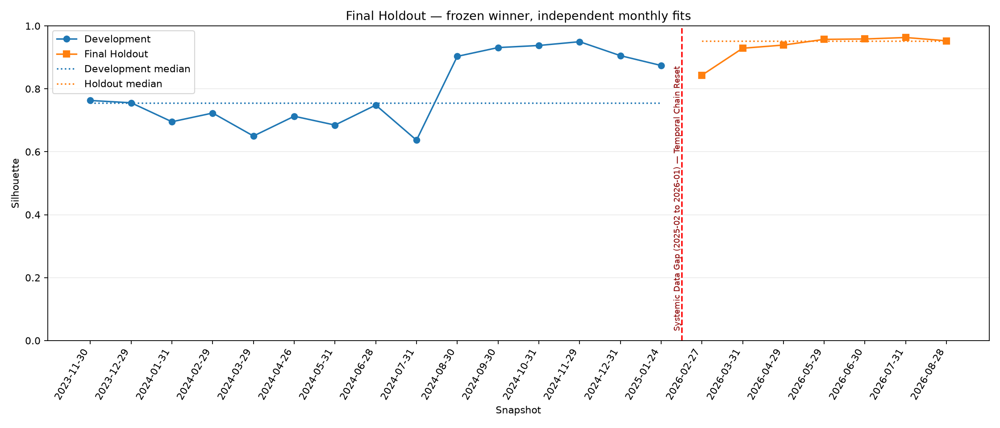

# Báo cáo Nhiệm vụ 11 — Final Holdout

## A — Gate và thực thi một chiều
Mô hình: **KMeans_Baseline**, Global K=2; seed=42,
n_init=10, max_iter=300.
Decision freeze: `2026-10-04T08:01:06+00:00`; mở holdout: `2026-10-04T08:14:18.565783+00:00`.
Chạy 7/7 snapshots, 4624 assignments và 6/6 cặp tháng.
Universe riêng mỗi tháng: 253–905 mã;
skip 0 snapshot. Robust Scaling fit mới từng snapshot;
chỉ algorithm thắng và K=2, không quét K hoặc chạy comparator.
Nguồn Feature Store 1.6.0: C8 checksummed `canonical/feature_snapshots.jsonl`;
không tạo bản sao hoặc sửa nguồn thành `data/canonical/market/`.

## B — Development so với Holdout
| Metric | Median Development | Median Holdout | Holdout − Development |
| --- | ---: | ---: | ---: |
| silhouette | 0.755722 | 0.952683 | +0.196961 |
| davies_bouldin | 0.521899 | 0.431560 | -0.090338 |
| calinski_harabasz | 316.391783 | 2330.382823 | +2013.991039 |
| inertia | 2158.608251 | 432647.471068 | +430488.862817 |
| cluster_balance | 0.067669 | 0.021445 | -0.046224 |
| ari | 0.798251 | 0.895529 | +0.097278 |
| nmi | 0.661313 | 0.791375 | +0.130062 |
| persistence_probability | 0.985618 | 0.995835 | +0.010217 |
| migration_rate | 0.014382 | 0.004165 | -0.010217 |

Delta_Silhouette = 0.952683 − 0.755722 = **+0.196961**.
Khoảng cách hình học được ghi nhận từ số liệu; chưa đủ để kết luận về chế độ vĩ mô hoặc sinh lợi. Các ngưỡng trong kế hoạch là rubric chẩn đoán, không tự chứng minh
không overfit hoặc Macro Regime Shift. Inertia phụ thuộc universe size.
Migration là chuyển nhãn trên tập mã chung, không phải turnover/chi phí danh mục.

## C — Hồ sơ cụm, gap reset và giới hạn
`profile_consistency.csv` so sánh đủ 8 feature gốc, theo vai trò Higher/Lower mom_63
tại từng tháng; không giả định C0/C1 có cùng identity xuyên gap. Mean/Median ở đây
là tổng hợp các mean của cụm theo tháng, không phải median từng cổ phiếu.
Quy mô cụm nhỏ nhất trên holdout: **10 mã**.

| Feature | Higher mom63 Dev mean | Higher mom63 Holdout mean | Lower mom63 Dev mean | Lower mom63 Holdout mean |
| --- | ---: | ---: | ---: | ---: |
| mom_21 | 0.021839 | -0.007125 | 0.018525 | -0.008531 |
| mom_63 | 0.084500 | 0.054265 | 0.022932 | -0.029105 |
| mom_126 | 0.134429 | 0.031212 | 0.054606 | -0.020684 |
| mom_252 | 0.383700 | 0.293938 | 0.197815 | 0.065293 |
| vol_63 | 0.329924 | 0.419660 | 0.321051 | 0.380297 |
| mdd_126 | -0.203946 | -0.259456 | -0.199716 | -0.246238 |
| beta_126 | 1.153144 | 0.711543 | 0.756204 | 0.497637 |
| liquidity_21 (tỷ VND) | 316.830043 | 404.209907 | 69.924005 | 115.470297 |

Thanh khoản trong artifact lưu VND, bảng trên đổi sang tỷ VND; momentum/risk ở thang gốc.
Không mặc định cụm momentum cao
phải thanh khoản lớn; không suy nguyên nhân vĩ mô chỉ từ profile.
Chuỗi holdout bắt đầu mới; không có cặp 2025-01-24 → 2026-02-27, không nối qua skip.
Đây là monthly independent clustering trong phạm vi market-only;
không phải dynamic clustering, strict research universe hoặc bằng chứng hiệu quả đầu tư.
Giữ nguyên phương pháp sau holdout; không retune bằng kết quả này.

## Cách mở và chạy lại
Mở `M2/notebooks/11_final_holdout_execution.ipynb`, chọn kernel Python đã dùng ở M2,
chạy từ repo hoặc thư mục notebook bằng Run All. Root được tìm tự động.
Lần chạy sau chỉ kiểm tra checksum và nạp artifacts đã hoàn tất, không fit lại.
Nếu inputs/checksum thay đổi hoặc run chưa complete, chương trình dừng để giữ evidence.
Nhiệm vụ 12/M3 chưa được thực hiện trong lần chạy này.
