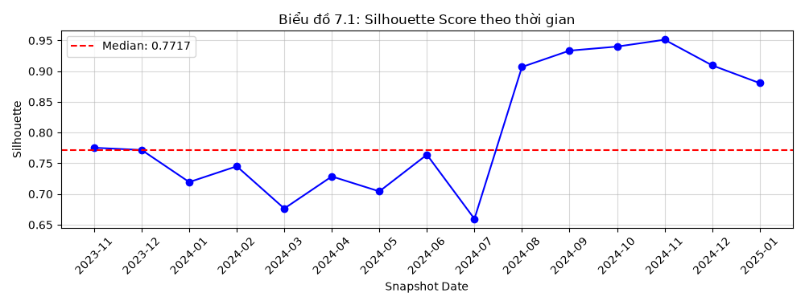
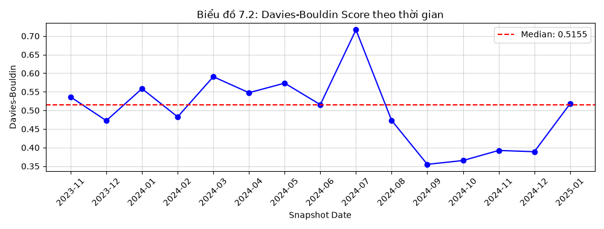
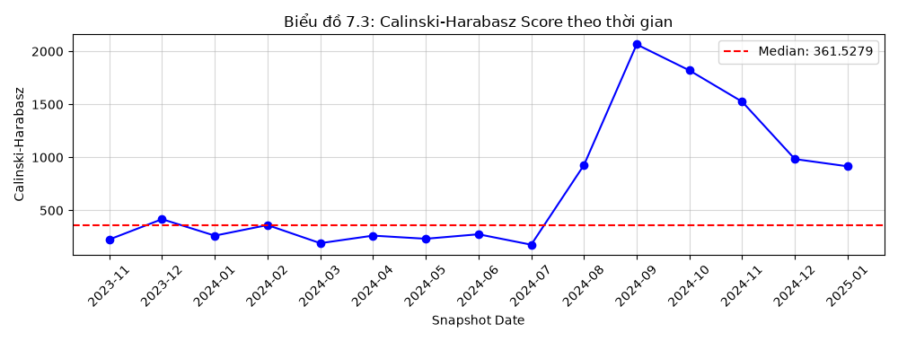
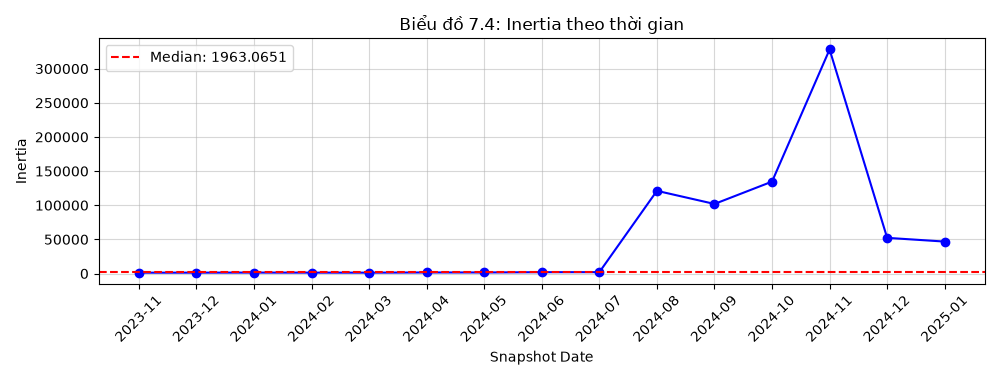
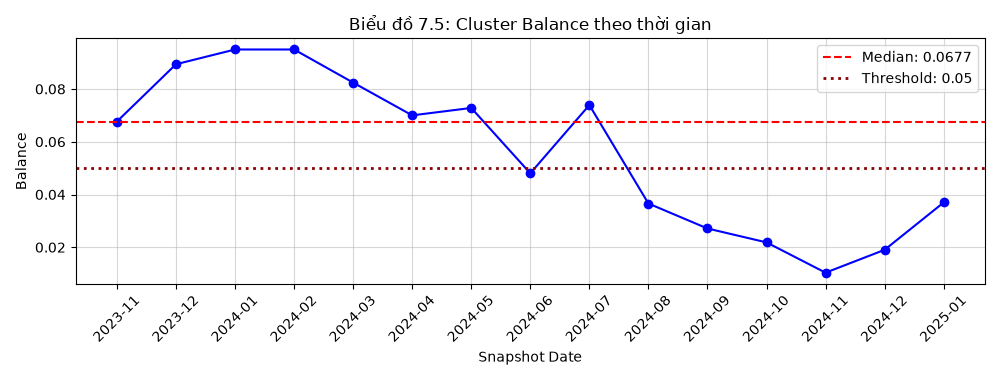

# Báo cáo M2 - Nhiệm vụ 7: Đánh giá chất lượng cụm (PCA + K-Means)

## 1. Kết quả Đánh giá Tổng quan (Quality Summary)
- **K = 2**
- **Median Silhouette:** 0.7717
- **Median Davies-Bouldin:** 0.5155
- **Median Calinski-Harabasz:** 361.5279
- **Median Inertia:** 1963.0651
- **Median Cluster Balance:** 0.0677
- **Số lượng Snapshot:** 15

## 2. Các Biểu đồ Đánh giá Chất lượng
### Biểu đồ 7.1: Silhouette Score

### Biểu đồ 7.2: Davies-Bouldin Score

### Biểu đồ 7.3: Calinski-Harabasz Score

### Biểu đồ 7.4: Inertia

### Biểu đồ 7.5: Cluster Balance

## 3. Khung kết luận 3 phần bắt buộc (Diagnostic Rubrics)

### Phần A (Phán quyết Kỹ thuật):
Mô hình PCA + K-Means (K=2) đạt điểm Silhouette Median là **0.7717** và Davies-Bouldin là **0.5155**. Điểm Silhouette dương và tương đối ổn định cho thấy sự tách biệt tốt. Tuy nhiên, mức độ cân bằng cụm (Cluster Balance) khá thấp (**0.0677**), thường xuyên tiệm cận hoặc dưới ngưỡng cảnh báo 5% (0.05). Điều này cho thấy hiện tượng Asymmetric Outlier Isolation (Phân cụm bất đối xứng / Cô lập nhóm ngoại lai).

### Phần B (Bản chất thị trường):
Nguyên nhân gốc rễ là do đặc tính của thị trường chứng khoán Việt Nam (có tính đầu cơ cao, lợi nhuận và rủi ro phân phối đuôi dày - heavy tails). Khi sử dụng thuật toán K-Means không có Winsorization/Clipping trên không gian PCA, thuật toán tự nhiên cô lập một nhóm nhỏ các cổ phiếu cực đoan (biến động siêu mạnh) thành một cụm riêng, phần đại đa số cổ phiếu còn lại nằm ở cụm lớn. 

### Phần C (Handoff cho Nhiệm vụ 10):
Mặc dù có mức độ cân bằng thấp, nhưng mô hình PCA + K-Means vẫn phản ánh trung thực một hiện tượng kinh tế thực tế của thị trường. Điểm Silhouette tốt chứng minh việc phân chia này mang lại biên giới phân biệt rõ ràng. Mô hình hoàn toàn đủ tiêu chuẩn chất lượng hình học để bước vào vùng so sánh đối đầu ở Nhiệm vụ 10 cùng với K-Means Baseline và Ward Hierarchical.
