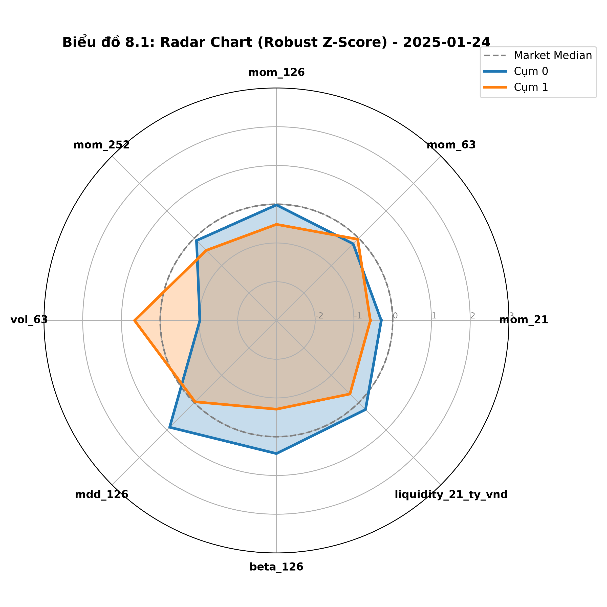
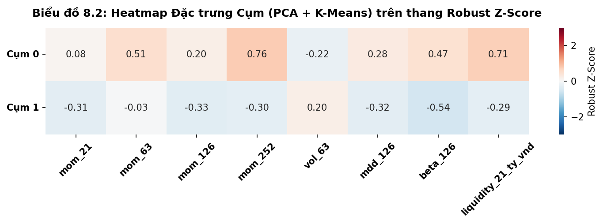

# Báo cáo Nhiệm vụ 8: Xây dựng Hồ sơ Cụm – PCA + K-Means
**Dự án:** Phân cụm động lượng điều chỉnh rủi ro trên thị trường chứng khoán Việt Nam
**Phạm vi:** 15 snapshot Development (30/11/2023 – 24/01/2025) | **Mô hình:** PCA + K-Means (Global K = 2)
**Nguồn:** `M2/artifacts/m2-task6-pca-kmeans-v1/profiles.csv` | **Notebook:** `M2/notebooks/08_cluster_profiling_pca_kmeans.ipynb` | **Hình:** `M2/artifacts/m2-evaluation-pca-kmeans/radar_chart.png`, `heatmap.png`

**TÓM TẮT KẾT QUẢ:**
Hồ sơ cụm được đọc trên 8 đặc trưng gốc (không phải trên các principal component). **Cụm 0** là nhóm nhỏ (trung vị 15 mã) có **thanh khoản `liquidity_21` ~359 tỷ, beta ~1,26 và động lượng dài hạn cao hơn rõ rệt**; **Cụm 1** là phần lớn universe (trung vị 229 mã) với thanh khoản ~14 tỷ và beta ~0,62. Rủi ro **không đi một chiều**: `vol_63` và `mdd_126` của Cụm 0 lại thấp hơn/nhẹ hơn Cụm 1 ở trung vị. Trên thang Robust Z-Score, ba đặc trưng `mom_252`, `beta_126`, `liquidity_21` có độ chênh lệch xấp xỉ nhau (~1,0), nên không có một động lực phân tách duy nhất. Hai cụm giữ tên trung tính "Cụm 0" và "Cụm 1"; kết quả chỉ mô tả cấu trúc lịch sử, không phải khuyến nghị đầu tư.

---

## 1. Mục tiêu

- Diễn giải tính chất kinh tế của hai cụm bằng 8 đặc trưng gốc: động lượng (21/63/126/252 phiên), rủi ro hệ thống (beta), biến động và sụt giảm (`vol_63`, `mdd_126`), thanh khoản (`liquidity_21`).
- Xác định động lực phân tách chính giữa hai cụm và kiểm tra hồ sơ có nhất quán theo thời gian không.
- Dùng đúng cấu trúc bảng và biểu đồ chung với K-Means Baseline và Ward để Nhiệm vụ 10 so sánh được.
- Giữ ranh giới M2: chỉ đánh giá cấu trúc vi mô, không đưa tỷ suất sinh lời, Sharpe hay khuyến nghị đầu tư (thuộc M3), và không gán nhãn chủ quan như "siêu cổ phiếu".

## 2. Dữ liệu và quá trình

- `profiles.csv` có 30 profile = 2 cụm × 15 snapshot; mỗi dòng lưu `aligned_cluster_id`, `size` và centroid (JSON) trên 8 feature gốc.
- Notebook tách JSON centroid, đổi `liquidity_21` sang **tỷ VNĐ** (chia 1e9), rồi tính Bảng 1–3 và hai biểu đồ. Thống kê là mean và median **qua 15 centroid theo snapshot** của từng cụm, không phải centroid của mẫu gộp.
- Biểu đồ dùng Robust Z-Score `(x − median) / IQR` tính trên toàn bộ 30 centroid, cắt trong khoảng [−3, 3]; Radar vẽ snapshot mới nhất (2025-01-24), Heatmap dùng median theo thời gian của mỗi cụm.
- Nhãn cụm theo `aligned_cluster_id`; không dùng `semantic_label` đổi theo snapshot.

## 3. Kết quả đạt được

### 8.1 – Bảng 1: Tổng hợp hồ sơ đặc trưng theo cụm

| Cụm | Size | `liquidity_21` (tỷ) | `beta_126` | `vol_63` | `mdd_126` | `mom_21` | `mom_63` | `mom_126` | `mom_252` |
|---|---:|---:|---:|---:|---:|---:|---:|---:|---:|
| Cụm 0 (Mean) | 14,73 | 371,81 | 1,3013 | 0,2972 | -0,1928 | 2,65% | 7,85% | 13,35% | 39,38% |
| Cụm 0 (Median) | 15 | 359,15 | 1,2562 | 0,2959 | -0,1773 | 3,07% | 7,49% | 10,16% | 41,23% |
| Cụm 1 (Mean) | 359,60 | 14,94 | 0,6080 | 0,3537 | -0,2109 | 1,38% | 2,90% | 5,55% | 18,77% |
| Cụm 1 (Median) | 229 | 14,27 | 0,6200 | 0,3348 | -0,2170 | 0,96% | 3,66% | 3,97% | 18,13% |

Mean của Cụm 1 về quy mô (359,6) cao hơn nhiều median (229) vì các snapshot từ 08/2024 có universe lớn; vì vậy cần đọc cùng dòng median.

### 8.2 – Bảng 2: So sánh đối đầu (Mean) và độ chênh chuẩn hóa

| Đặc trưng | Cụm 0 (Mean) | Cụm 1 (Mean) | Chênh lệch (Cụm 0 − Cụm 1) | Δ Robust Z (heatmap) |
|---|---:|---:|---:|---:|
| `size` | 14,73 | 359,60 | -344,87 | – |
| `liquidity_21` (tỷ) | 371,81 | 14,94 | +356,87 | **+1,00** |
| `beta_126` | 1,3013 | 0,6080 | +0,6933 | **+1,01** |
| `vol_63` | 0,2972 | 0,3537 | -0,0565 | -0,42 |
| `mdd_126` | -0,1928 | -0,2109 | +0,0181 | +0,60 |
| `mom_21` | 2,65% | 1,38% | +1,27 đ% | +0,39 |
| `mom_63` | 7,85% | 2,90% | +4,95 đ% | +0,54 |
| `mom_126` | 13,35% | 5,55% | +7,80 đ% | +0,53 |
| `mom_252` | 39,38% | 18,77% | +20,61 đ% | **+1,06** |

Chênh lệch thô không so sánh được giữa các đặc trưng vì khác đơn vị; cột cuối là hiệu hai giá trị trên Heatmap (median theo thời gian, thang Robust Z-Score): Cụm 0 lần lượt 0,08 / 0,51 / 0,20 / 0,76 / -0,22 / 0,28 / 0,47 / 0,71 và Cụm 1 lần lượt -0,31 / -0,03 / -0,33 / -0,30 / 0,20 / -0,32 / -0,54 / -0,29 cho `mom_21`, `mom_63`, `mom_126`, `mom_252`, `vol_63`, `mdd_126`, `beta_126`, `liquidity_21`.

### Bảng 3: Quy mô và thanh khoản qua 15 snapshot

| Snapshot | Size C0 | Size C1 | Thanh khoản C0 (tỷ) | Thanh khoản C1 (tỷ) | C0 / C1 (lần) |
|---|---:|---:|---:|---:|---:|
| 2023-11-30 | 9 | 133 | 201,23 | 8,90 | 22,6 |
| 2023-12-29 | 16 | 179 | 332,43 | 14,51 | 22,9 |
| 2024-01-31 | 17 | 179 | 295,17 | 14,27 | 20,7 |
| 2024-02-29 | 17 | 179 | 359,15 | 16,68 | 21,5 |
| 2024-03-29 | 15 | 182 | 492,02 | 26,10 | 18,9 |
| 2024-04-26 | 14 | 200 | 475,61 | 23,67 | 20,1 |
| 2024-05-31 | 15 | 206 | 419,72 | 24,66 | 17,0 |
| 2024-06-28 | 11 | 229 | 576,26 | 29,33 | 19,6 |
| 2024-07-31 | 17 | 230 | 323,08 | 20,24 | 16,0 |
| 2024-08-30 | 21 | 574 | 288,10 | 6,73 | 42,8 |
| 2024-09-30 | 16 | 590 | 371,03 | 7,29 | 50,9 |
| 2024-10-31 | 13 | 595 | 421,11 | 7,66 | 55,0 |
| 2024-11-29 | 8 | 772 | 462,59 | 7,83 | 59,1 |
| 2024-12-31 | 11 | 578 | 357,88 | 10,12 | 35,4 |
| 2025-01-24 | 21 | 568 | 201,76 | 6,19 | 32,6 |

*(Tỷ số C0/C1 tự tính từ hai cột thanh khoản; median 22,6 lần, nhỏ nhất 16,0, lớn nhất 59,1.)*

### Bảng phụ: đặc trưng chính từng snapshot (Cụm 0 / Cụm 1)

| Snapshot | Mom63 (%) | Beta | Vol | MDD |
|---|---|---|---|---|
| 2023-11-30 | -1,32 / -6,13 | 1,2675 / 0,6163 | 0,4109 / 0,3349 | -0,2380 / -0,2159 |
| 2023-12-29 | 13,46 / 1,09 | 1,4714 / 0,7630 | 0,3941 / 0,3276 | -0,2682 / -0,2355 |
| 2024-01-31 | 20,65 / 7,10 | 1,4877 / 0,7401 | 0,3047 / 0,2695 | -0,2765 / -0,2308 |
| 2024-02-29 | 16,43 / 8,43 | 1,4970 / 0,7188 | 0,2526 / 0,2651 | -0,2666 / -0,2193 |
| 2024-03-29 | 18,88 / 9,48 | 1,4264 / 0,6848 | 0,2715 / 0,2694 | -0,1939 / -0,1741 |
| 2024-04-26 | 3,86 / 1,54 | 1,3492 / 0,7109 | 0,3364 / 0,3111 | -0,1747 / -0,1741 |
| 2024-05-31 | 7,56 / 6,05 | 1,2510 / 0,6200 | 0,3401 / 0,3205 | -0,1566 / -0,1665 |
| 2024-06-28 | 7,49 / 2,85 | 1,2112 / 0,6414 | 0,3018 / 0,3348 | -0,1368 / -0,1700 |
| 2024-07-31 | 8,67 / 5,16 | 1,2635 / 0,6611 | 0,3119 / 0,3242 | -0,1773 / -0,1866 |
| 2024-08-30 | -1,12 / 3,95 | 1,2562 / 0,4659 | 0,2959 / 0,5002 | -0,2023 / -0,2439 |
| 2024-09-30 | 5,15 / -2,95 | 1,1981 / 0,4793 | 0,2764 / 0,4634 | -0,1928 / -0,2442 |
| 2024-10-31 | 13,05 / -0,36 | 1,1898 / 0,4795 | 0,2690 / 0,4333 | -0,1554 / -0,2431 |
| 2024-11-29 | 1,48 / -0,19 | 1,1594 / 0,4806 | 0,2327 / 0,4056 | -0,1636 / -0,2440 |
| 2024-12-31 | 0,98 / 3,79 | 1,2554 / 0,5457 | 0,2386 / 0,3694 | -0,1530 / -0,2170 |
| 2025-01-24 | 2,49 / 3,66 | 1,2357 / 0,5132 | 0,2219 / 0,3772 | -0,1364 / -0,1980 |

### 8.3 – Trực quan hóa

Radar tại 24/01/2025 (Cụm 0: 21 mã, Cụm 1: 568 mã): trục `vol_63` là nơi Cụm 1 cao hơn rõ và Cụm 0 thấp hơn median thị trường; trục `beta_126` và `liquidity_21_ty_vnd` thì Cụm 0 cao hơn Cụm 1 (số liệu tháng này: beta 1,2357 so với 0,5132; thanh khoản 201,76 so với 6,19 tỷ). Radar chỉ phản ánh một snapshot nên cần đọc cùng Heatmap.

Heatmap xác nhận cùng hình ảnh trên median theo thời gian: các ô dương rõ nhất của Cụm 0 là `mom_252` (0,76), `liquidity_21` (0,71), `mom_63` (0,51), `beta_126` (0,47); `vol_63` của Cụm 0 âm (-0,22), của Cụm 1 dương (0,20).

## 4. Phân tích và nhận định

### Phần A – Chân dung kinh tế (nhãn trung tính)
- **Cụm 0** (trung vị 15 mã): thanh khoản `liquidity_21` ~359 tỷ, cao hơn Cụm 1 khoảng 22–25 lần; beta ~1,26 so với ~0,62 (cao hơn ở cả 15 snapshot, gấp 1,89–2,70 lần); động lượng cao hơn ở mọi kỳ hạn (`mom_252` 41,2% so với 18,1% ở trung vị); `mom_63` cao hơn ở 12/15 tháng. Về mặt dữ liệu, đây là nhóm **thanh khoản cao, beta cao, động lượng cao, quy mô nhỏ**.
- **Cụm 1** (trung vị 229 mã): thanh khoản ~14 tỷ, beta ~0,62, động lượng thấp hơn; đại diện phần lớn universe.
- **Rủi ro không một chiều:** ở trung vị, `vol_63` của Cụm 0 thấp hơn (0,296 so với 0,335) và `mdd_126` ít âm hơn (-0,177 so với -0,217). Trên từng tháng, `vol_63` của Cụm 0 cao hơn Cụm 1 ở 6/15 tháng và `mdd_126` nặng hơn ở 6/15 tháng. Vì vậy không thể gọi Cụm 0 là nhóm "rủi ro cao" chung chung: nó chỉ có beta cao hơn rõ rệt.

### Phần B – Động lực phân tách chính (Primary Driver Test)
Theo độ chênh lệch trên thang Robust Z-Score, `mom_252` (+1,06), `beta_126` (+1,01) và `liquidity_21` (+1,00) gần như ngang nhau và đứng đầu; tiếp theo là `mdd_126` (+0,60), `mom_63` (+0,54), `mom_126` (+0,53), `vol_63` (-0,42) và `mom_21` (+0,39). Kết luận: **không có một động lực chi phối duy nhất**; phân tách chủ yếu theo nhóm *beta và thanh khoản cao đi cùng động lượng dài hạn cao*, còn `vol_63` và `mdd_126` là các trục kém phân biệt hơn (và `vol_63` chiều ngược lại).

### Nhất quán theo thời gian (Profile Temporal Consistency)
- Cụm 0 giữ thanh khoản và beta cao hơn Cụm 1 ở **15/15 tháng** (thanh khoản gấp 16,0–59,1 lần; beta gấp 1,89–2,70 lần).
- Động lượng `mom_63` của Cụm 0 cao hơn ở 12/15 tháng, thấp hơn ở 3 tháng: 2024-08 (-1,12% so với 3,95%), 2024-12 (0,98% so với 3,79%) và 2025-01 (2,49% so với 3,66%).
- Ở các tháng thị trường điều chỉnh mà kế hoạch nêu (04/2024, 07/2024), Cụm 0 không trở thành nhóm sụt giảm sâu nhất: `mdd_126` 04/2024 gần như bằng nhau (-0,1747 so với -0,1741) và 07/2024 nhẹ hơn (-0,1773 so với -0,1866). Việc đối chiếu với diễn biến VN-Index chưa thực hiện vì không có dữ liệu chỉ số trong báo cáo này.
- Từ 08/2024, thanh khoản và beta của Cụm 1 giảm rõ (thanh khoản 20,24 → 6,73 tỷ; beta 0,6611 → 0,4659) và `vol_63` tăng (0,3242 → 0,5002) trong khi universe tăng từ 247 lên 595 mã, nên khoảng cách thanh khoản giữa hai cụm doãng ra. Điều này cho thấy hồ sơ Cụm 1 phụ thuộc vào thành phần universe.

### Phần C – Khả năng áp dụng cho M3 (chỉ nhận định, không khuyến nghị)
Cụm 0 có thanh khoản trung vị cao hơn ~22 lần nên về lý thuyết thuận lợi hơn cho việc giải ngân, nhưng chỉ có 8–21 mã mỗi tháng nên sức chứa danh mục và độ tập trung là hạn chế lớn. M2 chưa đo trượt giá hay chi phí giao dịch, nên chưa thể kết luận cụm có đủ thanh khoản để giải ngân thực tế; việc này phải kiểm tra ở M3 bằng backtest. Không suy diễn rằng nên hoặc không nên mua cụm nào.

## 5. Giới hạn diễn giải

- Hồ sơ mô tả dữ liệu lịch sử Development, không phải dự báo lợi nhuận.
- Cụm 0 chỉ 8–21 mã nên mean và median nhạy với từng mã và với thay đổi universe; luôn đối chiếu hai dòng.
- Các feature khác đơn vị: không dùng heatmap giá trị thô; cần Robust Z-Score hoặc tách panel. Radar và Heatmap đã chuẩn hóa nhưng Z-Score tính trên phân phối của 30 centroid, nên đo "khoảng cách giữa các centroid" chứ không đo phân phối từng cổ phiếu.
- PCA là cách tạo cụm; không diễn giải một principal component như tín hiệu đầu tư.

## 6. Tổng hợp nhận xét

Task 8 tạo được hồ sơ cụm trên cùng 8 đặc trưng gốc, bảo đảm so sánh công bằng với K-Means Baseline và Ward ở Nhiệm vụ 10. Cụm 0 là nhóm nhỏ có thanh khoản cao, beta cao và động lượng dài hạn cao; Cụm 1 là phần lớn universe. Sự phân tách dựa đồng thời trên beta, thanh khoản và động lượng 252 phiên, còn biến động và sụt giảm không phải trục chi phối. Phát hiện cần được Task 9 kiểm tra về độ bền theo thời gian và giữ ở mức mô tả.

**Bàn giao:** notebook `08_cluster_profiling_pca_kmeans.ipynb`; `radar_chart.png`, `heatmap.png`; báo cáo này.

## 7. Lưu ý kiểm tra notebook

Ô kết luận Markdown cuối notebook 08 **mâu thuẫn với chính số liệu của notebook** và cần sửa trước khi nộp:
1. Notebook gọi Cụm 0 là "Nhóm Cổ phiếu Cô lập ngoại lai / Siêu biến động" và nói Cụm 0 có MDD và `vol_63` cực đại. Số liệu cho thấy ngược lại: `vol_63` trung vị 0,296 so với 0,335 và Z-Score -0,22 (thấp hơn median thị trường), `mdd_126` ít âm hơn. Tên gọi "siêu biến động" cũng trái nguyên tắc nhãn trung tính của kế hoạch.
2. Notebook kết luận động lực phân tách số 1 là `vol_63` và `mdd_126` dựa trên "độ chênh lệch tuyệt đối" của Bảng 2. So sánh chênh lệch thô giữa các đặc trưng khác đơn vị không có ý nghĩa; trên thang Robust Z-Score, `vol_63` chỉ đứng áp chót về độ lớn (|0,42|) và `mdd_126` ở giữa.
3. Notebook kết luận Cụm 0 chứa MDD quá cao nên không nên giải ngân và Cụm 1 "phù hợp làm nền tảng cốt lõi". Đây vừa không được số liệu ủng hộ vừa gần với khuyến nghị đầu tư, điều kế hoạch cấm ở M2.
4. Mô tả "Cụm 1 kích thước trung bình > 250 mã" đúng với mean (359,6) nhưng median là 229.
5. Notebook chưa tính độ chênh trên thang Robust Z-Score theo quy tắc Primary Driver Test của kế hoạch; mục 4 Phần B của báo cáo này lấy giá trị từ các ô Heatmap.
6. Tỷ số C0/C1 trong Bảng 3 của báo cáo là phép tính bổ sung, không có trong notebook.
