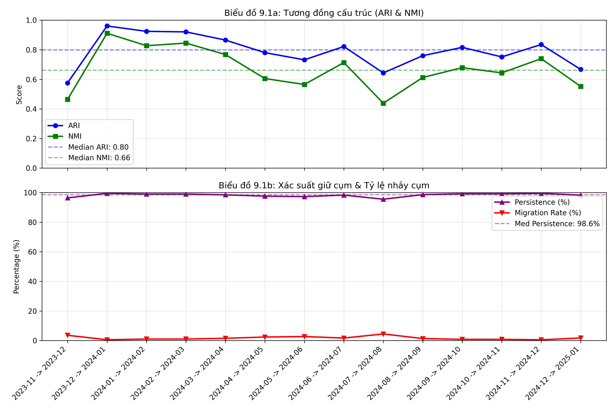
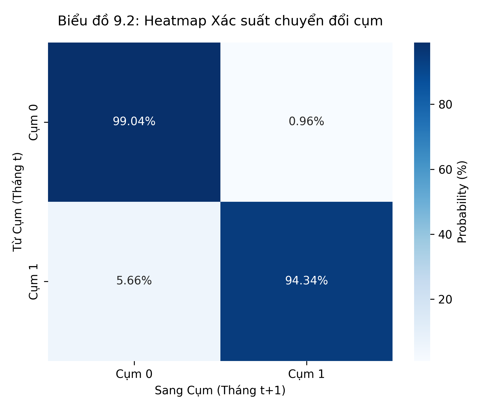

# Báo cáo Nhiệm vụ 9: Đánh giá Độ ổn định Thời gian – PCA + K-Means
**Dự án:** Phân cụm động lượng điều chỉnh rủi ro trên thị trường chứng khoán Việt Nam
**Phạm vi:** 14 cặp snapshot liên tiếp trong Development (30/11/2023 – 24/01/2025) | **Mô hình:** PCA + K-Means (Global K = 2)
**Nguồn:** `M2/artifacts/m2-evaluation-pca-kmeans/` (`temporal_stability.csv`, `transition_matrices.csv`, `centroid_drift.csv`) | **Notebook:** `M2/notebooks/09_temporal_stability_pca_kmeans.ipynb` | **Hình:** `temporal_trends.png`, `transition_heatmap.png`

**TÓM TẮT KẾT QUẢ:**
Trên 14 cặp tháng liên tiếp, phân hoạch PCA + K-Means có mức tương đồng cao: **median ARI 0,7983** (0,5758–0,9608) và **median NMI 0,6613** (0,4387–0,9113). **Median persistence 98,56%**, tức **migration chỉ 1,44%** (tối đa 4,47%), đều nằm trong ngưỡng an toàn của kế hoạch (persistence ≥ 80%, migration ≤ 15%). Cả hai cụm đều giữ cụm rất bền trong ma trận chuyển dịch (99,04% và 94,34%), nhưng nhóm có cơ sở mẫu nhỏ hơn (512 lượt) chuyển cụm nhiều hơn (5,66%). Cần lưu ý migration chỉ tính trên các mã có mặt ở cả hai tháng; các mã vào/rời universe (đỉnh 349 mã vào ở 07→08/2024) làm tăng luân chuyển thực tế. Kết quả là bằng chứng độ bền cho nhánh PCA, chưa đủ để kết luận bền hơn K-Means hay Ward.

---

## 1. Mục tiêu

- Đo mức tương đồng giữa các phân hoạch liên tiếp (ARI, NMI) và xác suất mã giữ/chuyển cụm (persistence, migration).
- Lập ma trận chuyển dịch cụm 2 × 2, đo độ trôi tâm cụm (centroid drift) trên 8 feature gốc và theo dõi mã vào/rời universe (entry/exit).
- Kiểm tra cơ chế ngắt chuỗi (reset) tại gap dữ liệu.
- Xuất cùng bộ 4 bảng và 2 biểu đồ chuẩn với K-Means Baseline và Ward để Nhiệm vụ 10 so sánh chéo.
- Giữ ranh giới M2: đây là chẩn đoán độ bền chuỗi thời gian, không phải Dynamic Clustering và không dùng để suy diễn cụm nào sinh lời tốt hơn.

## 2. Dữ liệu và quá trình

- Mỗi snapshot được phân cụm độc lập rồi so sánh với tháng kế tiếp trên **giao** của hai snapshot; nhãn cụm được căn chỉnh giữa hai tháng bằng thuật toán khớp nhãn (Hungarian) trước khi tính chỉ số. Notebook chỉ đọc artifact đã đóng băng, không huấn luyện lại.
- Notebook kiểm tra cơ chế ngắt chuỗi: không tồn tại cặp nào bắt đầu từ 2025-01-24, tức chuỗi dừng đúng ở snapshot cuối của Development.
- 15 snapshot là chuỗi tháng liên tiếp nên có đúng 14 chuyển tiếp và không cần reset bên trong Development.
- Migration = 1 − Persistence trên giao universe, và không tính mã mới hoặc mã rời. Tỷ lệ luân chuyển ở Bảng 4 (notebook) = (Entry + Exit) / `n_common`.

## 3. Kết quả đạt được

### Bảng 1 – Chỉ số temporal toàn kỳ (14 cặp)

| Chỉ số | Số cặp | Trung bình | Trung vị | Nhỏ nhất | Lớn nhất |
|---|---:|---:|---:|---:|---:|
| ARI | 14 | 0,7896 | **0,7983** | 0,5758 | 0,9608 |
| NMI | 14 | 0,6690 | **0,6613** | 0,4387 | 0,9113 |
| Persistence (%) | 14 | 98,2756 | **98,5618** | 95,5285 | 99,4863 |
| Migration (%) | 14 | 1,7244 | **1,4382** | 0,5137 | 4,4715 |

ARI ≥ 0,70 ở 11/14 cặp (ba cặp thấp hơn: 2023-11→12 với 0,5758; 2024-07→08 với 0,6432; 2024-12→2025-01 với 0,6672); không cặp nào dưới 0,50. NMI ≥ 0,70 ở 6/14 cặp.

### Bảng 2 – Ma trận chuyển dịch tích lũy 2 × 2 (gộp 14 cặp)

| Từ cụm | Sang cụm | Số lượt | Cơ sở | Tỷ lệ |
|---|---|---:|---:|---:|
| Cụm 0 | Cụm 0 (giữ nguyên) | 4.252 | 4.293 | 99,04% |
| Cụm 0 | Cụm 1 (chuyển cụm) | 41 | 4.293 | 0,96% |
| Cụm 1 | Cụm 0 (chuyển cụm) | 29 | 512 | 5,66% |
| Cụm 1 | Cụm 1 (giữ nguyên) | 483 | 512 | 94,34% |

Tổng 4.805 lượt, trong đó 4.735 giữ cụm (98,54%) và 70 chuyển cụm. Hướng chuyển gần như đối xứng về số lượt (41 và 29).

### Bảng 3 – Độ lệch tâm cụm tuyệt đối trung bình giữa hai tháng liền kề

| Đặc trưng | Cụm 0 (Mean |Δ|) | Cụm 1 (Mean |Δ|) |
|---|---:|---:|
| `beta_126` | 0,0489 | 0,0566 |
| `vol_63` | 0,0334 | 0,0281 |
| `mdd_126` | 0,0159 | 0,0227 |
| `mom_21` | 4,05 đ% | 5,94 đ% |
| `mom_63` | 3,51 đ% | 6,12 đ% |
| `mom_126` | 4,67 đ% | 6,46 đ% |
| `mom_252` | 6,42 đ% | 9,60 đ% |
| `liquidity_21` | 18,77 tỷ | 79,33 tỷ |

Drift lưu theo từng feature và từng cụm, không gộp thành một số vì khác đơn vị. Drift thanh khoản của nhóm lớn hơn theo đơn vị tiền tệ không phải bằng chứng riêng về kém ổn định.

### Bảng 4 – Biến động universe và độ ổn định từng cặp

| Từ → đến | ARI | NMI | Persistence | Migration | `n_common` | Entry | Exit | Luân chuyển (E+X)/`n_common` |
|---|---:|---:|---:|---:|---:|---:|---:|---:|
| 2023-11 → 2023-12 | 0,5758 | 0,4647 | 96,43% | 3,57% | 140 | 55 | 2 | 40,71% |
| 2023-12 → 2024-01 | 0,9608 | 0,9113 | 99,48% | 0,52% | 191 | 5 | 4 | 4,71% |
| 2024-01 → 2024-02 | 0,9242 | 0,8272 | 98,98% | 1,02% | 196 | 0 | 0 | 0,00% |
| 2024-02 → 2024-03 | 0,9207 | 0,8451 | 98,98% | 1,02% | 196 | 1 | 0 | 0,51% |
| 2024-03 → 2024-04 | 0,8653 | 0,7675 | 98,48% | 1,52% | 197 | 17 | 0 | 8,63% |
| 2024-04 → 2024-05 | 0,7803 | 0,6053 | 97,62% | 2,38% | 210 | 11 | 4 | 7,14% |
| 2024-05 → 2024-06 | 0,7320 | 0,5652 | 97,29% | 2,71% | 221 | 19 | 0 | 8,60% |
| 2024-06 → 2024-07 | 0,8217 | 0,7134 | 98,32% | 1,68% | 238 | 9 | 2 | 4,62% |
| 2024-07 → 2024-08 | 0,6432 | 0,4387 | 95,53% | 4,47% | 246 | 349 | 1 | 142,28% |
| 2024-08 → 2024-09 | 0,7599 | 0,6127 | 98,65% | 1,35% | 591 | 15 | 4 | 3,21% |
| 2024-09 → 2024-10 | 0,8162 | 0,6790 | 99,17% | 0,83% | 605 | 3 | 1 | 0,66% |
| 2024-10 → 2024-11 | 0,7515 | 0,6436 | 99,18% | 0,82% | 608 | 172 | 0 | 28,29% |
| 2024-11 → 2024-12 | 0,8351 | 0,7397 | 99,49% | 0,51% | 584 | 5 | 196 | 34,42% |
| 2024-12 → 2025-01 | 0,6672 | 0,5522 | 98,28% | 1,72% | 582 | 7 | 7 | 2,41% |

Số mã chung: trung vị 229,5 (140–608), trung bình 343,2. Entry: trung vị 10, trung bình 47,7 (0–349). Exit: trung vị 1,5, trung bình 16,1 (0–196).

### Biểu đồ

Biểu đồ 9.1 cho thấy ARI và NMI dao động trong 0,44–0,96 quanh các đường median (0,80 và 0,66), trong khi persistence gần như phẳng ở 95–99% và migration luôn dưới 5%.

## 4. Phân tích và nhận định

### Phần A – Độ ổn định cấu trúc
Median ARI 0,7983 và NMI 0,6613 cho thấy phân hoạch giữa hai tháng liền kề khá giống nhau nhưng không bất biến; ARI vượt ngưỡng kỳ vọng 0,70 ở 11/14 cặp. NMI thấp hơn ARI, đặc biệt ở các cặp thấp nhất (2024-07→08: 0,4387; 2023-11→12: 0,4647), cho thấy thông tin phân cụm vẫn thay đổi khi membership thay đổi.

### Phần B – Độ bền thành viên và tác động turnover
- **Persistence ≥ 80% (kịch bản quán tính cao):** persistence thấp nhất là 95,53%, cao hơn xa ngưỡng 80% và 60%; không có dấu hiệu xáo trộn ngẫu nhiên (cluster churning).
- **Migration ≤ 15% (kịch bản vận hành an toàn):** migration tối đa 4,47%, median 1,44%. Theo nguyên lý nối M2–M3, đây là cận dưới của tỷ lệ tái cơ cấu nếu dùng cụm làm tín hiệu.
- **Điều kiện cần đọc cùng:** migration không tính mã vào/rời universe. Khi cộng Entry + Exit, luân chuyển ở Bảng 4 lên tới 142,28% (2024-07→08), 40,71% (2023-11→12), 34,42% (2024-11→12) và 28,29% (2024-10→11). Vì vậy migration thấp không đồng nghĩa chi phí giao dịch thấp; chi phí thực phải đo ở backtest M3.
- **Hai nhóm bền không như nhau:** nhóm có cơ sở 512 lượt giữ cụm 94,34% còn nhóm 4.293 lượt giữ 99,04%; nhóm nhỏ hơn dễ biến động hơn, nhất quán với việc một cụm trong mô hình chỉ có 8–21 mã (Task 7, 8).

### Giải mã các tháng sụt giảm (Market Shock Analysis)
Không cặp nào có ARI dưới 0,50. Ba cặp thấp nhất đều trùng với giai đoạn universe biến động: 2023-11→12 (55 mã vào, `n_common` chỉ 140), 2024-07→08 (349 mã vào, 142% luân chuyển) và 2024-12→2025-01 (chỉ 7 mã vào, 7 mã rời, nên đây là cặp duy nhất không giải thích được bằng thay đổi universe). Chưa đối chiếu với diễn biến VN-Index vì báo cáo này không có dữ liệu chỉ số; mọi liên hệ với biến động thị trường chung cần kiểm tra thêm.

### Phần C – Bàn giao cho Nhiệm vụ 10
Nhánh PCA + K-Means đạt các ngưỡng độ bền của kế hoạch (persistence ≥ 80%, migration ≤ 15%, ARI median > 0,70) nên đủ điều kiện vào vòng so sánh. Tuy nhiên đây là bằng chứng cho riêng nhánh PCA; chưa có artifact cùng protocol của K-Means Baseline và Ward nên chưa thể nói PCA bền hơn.

## 5. Giới hạn học thuật

- Phân cụm độc lập từng snapshot rồi nối lại chỉ là chẩn đoán độ bền, không phải Dynamic Clustering.
- Không dùng chỉ số ổn định để suy diễn cụm nào sinh lời hay chọn mã (thuộc M3).
- ARI, NMI, persistence và migration chỉ tính trên giao hai tháng; các mã mới/rời được tách riêng.
- Drift tuyệt đối theo đơn vị gốc không so sánh được giữa các feature.
- Thanh khoản và quy mô cụm khác nhau nên migration tổng hợp bị chi phối bởi nhóm lớn.

## 6. Tổng hợp nhận xét

Nhánh PCA + K-Means cho assignment bền trên phần universe chung: median ARI 0,7983, NMI 0,6613, persistence 98,56% và migration 1,44%, mọi cặp đều trong ngưỡng an toàn. Hạn chế là các thay đổi universe lớn (đỉnh 349 mã vào) và sự bất cân xứng giữa hai nhóm (nhóm nhỏ giữ cụm kém hơn). Kết quả đủ làm đầu vào Nhiệm vụ 10, chưa đủ kết luận PCA bền hơn K-Means hay Ward.

**Bàn giao:** notebook `09_temporal_stability_pca_kmeans.ipynb`; `temporal_trends.png`, `transition_heatmap.png`; báo cáo này.

## 7. Lưu ý kiểm tra dữ liệu và notebook (cần xử lý trước khi nộp)

1. **Ô kết luận Markdown trong notebook lệch với số liệu chính nó in ra.** Notebook viết "Median ARI = 0.845, NMI = 0.77, Persistence 98.9%, Migration ~1.02%", trong khi Bảng 1 notebook tính ra 0,7983; 0,6613; 98,56%; 1,44% (khớp với biểu đồ 9.1). Báo cáo này dùng số do code tính ra; ô kết luận cần sửa.
2. **Báo cáo bản trước có median sai.** Bản trước ghi median ARI 0,8162, NMI 0,6790, persistence 98,65%, migration 1,52% — đó là giá trị thứ 8 trong 14 cặp đã sắp xếp, trong khi median của 14 giá trị là trung bình của giá trị thứ 7 và thứ 8 (ARI: (0,7803 + 0,8162)/2 = 0,7983). Các median số mã chung (238), entry (11), exit (2) của bản trước cũng sai vì cùng lỗi; số đúng là 229,5; 10; 1,5. Các slide hoặc văn bản đã dùng số bản trước cần cập nhật.
3. **Ma trận chuyển dịch khó khớp với Task 8.** `transition_matrices.csv` cho cơ sở 4.293 lượt ở "Cụm 0" và 512 lượt ở "Cụm 1", trong khi hồ sơ Task 8 cho thấy Cụm 0 là nhóm chỉ 8–21 mã/tháng (khoảng 199 lượt sau 14 cặp) và Cụm 1 là nhóm lớn. Bản báo cáo trước ghi 161/199 và 4.574/4.606. Tổng số lượt (4.805), tổng giữ cụm (4.735) và tổng chuyển cụm (70) khớp giữa hai nguồn, nhưng cách chia theo cụm khác nhau, nghĩa là nhãn cụm trong `transition_matrices.csv` có thể được căn chỉnh khác `aligned_cluster_id` của `profiles.csv`. Báo cáo này lấy số của notebook và mô tả theo "nhóm có cơ sở nhỏ hơn" để kết luận không phụ thuộc nhãn; cần đối chiếu file trước khi gắn tên cụm vào Bảng 2.
4. **Kiểm tra gap quá yếu.** Ô kiểm tra chỉ xác nhận không có cặp nào xuất phát từ 2025-01-24 (snapshot cuối), nên không thực sự kiểm tra cơ chế reset. Nên bổ sung kiểm tra khoảng cách giữa các `to_date` và `from_date` liên tiếp.
5. **Nhận định "không tạo cụm ảo", "tối ưu chi phí giao dịch tối đa" vượt quá bằng chứng:** migration không gồm entry/exit và M2 chưa đo chi phí; nên bỏ hoặc hạ giọng.
6. Notebook chưa xuất tỷ lệ chuyển cụm theo từng cặp tháng và chưa đối chiếu các tháng ARI thấp với VN-Index.
