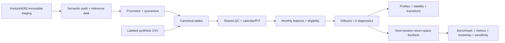

# Delta T1 - Phân cụm động lượng điều chỉnh rủi ro

Pipeline nghiên cứu cổ phiếu Việt Nam, snapshot cuối tháng, identity theo thời gian và QC. v0.2 có promotion được chặn bằng evidence, KMeans, stability/transitions và backtest trên chuỗi lợi suất. **Pipeline offline đã chạy trên synthetic; phase dữ liệu thật và nghiệm thu M1/M2/M3 chưa hoàn tất.**

## Luồng nghiên cứu v0.2



Core nghiên cứu dùng stdlib; plots cần optional Matplotlib. Môi trường `.venv` hiện
có dependencies. Môi trường mới có thể cài `python -m pip install -e ".[research]"`
hoặc lock plotting `requirements-research.lock.txt` (Windows/Python 3.12, cần kiểm tra
lại trên nền tảng khác). Không bật plots thì research không cần thư viện ngoài.

```powershell
.venv\Scripts\python.exe scripts/run_offline_pilot.py
```

Lệnh tạo **6 mã synthetic / 18 tháng** qua vendor envelope → promotion → shared
QC/features → clustering → backtest. Mỗi lần dùng ID mới, giữ lineage tại
`data/offline_pilots/<id>/result.json`. Đây là pilot kỹ thuật, không phải bằng chứng thị trường.

Với run canonical/CSV đã hoàn tất:

```powershell
.venv\Scripts\python.exe scripts/run_research.py data/runs/<run_id> --config configs/research.demo.json
.venv\Scripts\python.exe scripts/promote_vnstock.py vendor-26f2e2ce615c --policy configs/promotion.kbs.unresolved.json
```

Lệnh promote mẫu phải **BLOCK**: semantics/reference chưa xác minh. Xem
[vendor audit](docs/data/vendor_semantics.md) và [promotion policy](docs/promotion.md).
Audit còn phát hiện một số raw cũ đã đổi định dạng nên lệch checksum; bản phục hồi
`vendor-recovered-fccfaaa2b061` sao chép bytes khớp hash từ cache, giữ nguyên mọi file
cũ. Promote bản phục hồi vẫn BLOCK vì reference/semantics chưa đủ.
Khi có promotion hợp lệ, dùng `scripts/run_research.py data/canonical/<id>
--canonical-feature-config configs/your_features.json --config configs/your_research.json`.
Feature config gồm synthetic/features theo demo; nghiên cứu chỉ đánh giá development,
chưa cho phép tuning/đánh giá holdout không có protocol đã khóa.

Experiments ở `data/experiments/<id>` gồm model/scaler, assignments, profiles,
diagnostics k=2..10, stability/transitions, targets, backtest, metrics, bootstrap,
cost sensitivity, plots và report. Manifest giữ config, code/git/data/environment,
seed, timestamps và artifact hashes. Input/code/config đổi phải tạo run mới;
completed resume chỉ verify rồi trả run cũ, không ghi đè experiment.

Backtest là **fractional return-space**, có cash, trọng số trôi, khớp close phiên kế
tiếp và phí/slippage; chưa là ledger cổ phiếu có lô, settlement, quyền mua/cổ tức và
delisting recovery. Không dùng adjusted level làm raw fill price. Dữ liệu thật còn
thiếu historical master/calendar/actions và semantics. Không tuyên bố hết
survivorship bias hay có ý nghĩa thống kê từ synthetic.

Sau pilot thật mới dùng `scripts/plan_crawl.py data/experiments/<pilot_id>
--config configs/crawl.scale.template.json`. Template chưa có universe/evidence.
Crawler trên 10 mã yêu cầu `--pilot-experiment`; synthetic không mở gate. Không có
crawl 300 mã tự chạy trong tác vụ này.

Tài liệu hiện hành: [audit](docs/project_audit.md), [phase report](docs/phase_report.md),
[dictionary](docs/data_dictionary.md), [methodology](docs/methodology.md),
[PIT](docs/point_in_time.md), [backtest](docs/backtest.md), [limitations](docs/research_limitations.md).

## Đọc theo thứ tự

1. [Đánh giá các PDF](docs/DOCUMENT_REVIEW.md): phù hợp đến đâu, còn thiếu gì.
2. [Kiến trúc và tổ chức code](docs/ARCHITECTURE.md): luồng xử lý, ownership và điểm mở rộng.
3. [Data contract và quan hệ schema](docs/DATA_CONTRACT.md).
4. [Crawl dữ liệu ban đầu](docs/CRAWLING.md) và [đánh giá nguồn](docs/SOURCE_EVALUATION.md).
5. [Đặc tả feature](docs/FEATURE_SPEC.md), [plan](docs/PLAN.md), [quy tắc phát triển](DEVELOPMENT_RULES.md), [decision log](docs/DECISIONS.md), [changelog](CHANGELOG.md).

## Chạy ngay, không cần API key hay thư viện ngoài

Python 3.11 trở lên. Chạy từ thư mục `SourceCode`:

```powershell
python scripts/generate_demo.py
python run.py run --config configs/demo.json
python -m unittest discover -s tests -v
```

Demo tạo 12 mã `SYN00`–`SYN11`, dữ liệu **giả lập**, trong 18 tháng. Lịch chỉ gồm ngày trong tuần để kiểm thử; không phải lịch giao dịch Việt Nam. Không dùng sample này để chứng minh M1 hoặc kết luận nghiên cứu.

Nếu máy chưa nhận lệnh `python`, dùng đường dẫn tới Python đã cài thay cho `python`. Core không cần `pip install`. Có thể cài package với `python -m pip install -e .` để dùng CLI `delta`.

Đầu ra nằm ở `data/runs/<run_id>/`:

```text
manifest.json                 # trạng thái, nguồn, cấu hình, hash, môi trường
raw/<job_id>/page-00000.csv    # nguyên bản bytes CSV; HTTP dùng .json
clean/*.jsonl                 # các bảng đã chuẩn hóa
quality/issues.jsonl          # lỗi có rule_id; rỗng khi không có lỗi
quality/quarantine.jsonl      # dòng bị cách ly
quality/coverage.json         # số mã/năm/sàn, phiên thiếu, eligible theo tháng
features/monthly.jsonl        # chỉ tạo khi tải và QC bắt buộc thành công
```

CLI in `run_id` và đường dẫn manifest. Mã thoát `0` là luồng dữ liệu hoàn tất; `2` là lỗi tải/QC/config. `complete` không đồng nghĩa đạt M1: xem coverage, nguồn và tiêu chí nghiệm thu riêng.

## Tải thử nguồn công khai

Ứng viên ban đầu: Vnstock Community 4.0.6. Cài riêng để không làm nặng core:

Trên workspace bàn giao, `.venv` đã có SDK và sample thật trong `data/vendor/vendor-26f2e2ce615c`; có thể dùng thẳng lệnh crawler. Các bước cài dưới đây dành cho môi trường mới.

```powershell
python -m venv .venv
.venv\Scripts\python.exe -m pip install "vnstock==4.0.6"
.venv\Scripts\python.exe scripts/crawl_vnstock.py --symbols FPT VNM PVS --start 2026-08-01 --end 2026-08-31
```

Bỏ `--symbols` để tải bộ mẫu 3 ticker FPT/VNM/PVS, cùng danh mục niêm yết hiện tại và VNINDEX. Không mặc định các ticker mẫu đại diện đầy đủ thị trường hoặc sàn lịch sử.

Crawler ghi vào `data/vendor/<vendor_run_id>/`, lưu checkpoint, chia khoảng ngày và timeout mỗi tác vụ SDK. **Kết quả ở lớp vendor cần audit trước khi chuyển thành canonical**: chưa tự coi `close` là cả `raw_close` và `adj_close`, chưa gán danh sách mã hiện tại ngược về quá khứ. Xem [hướng dẫn crawl](docs/CRAWLING.md).

Không có tài khoản/nguồn do mentor cấp. Các giả định kỹ thuật ở đây là lựa chọn triển khai của project; các tiêu chí học thuật chưa chốt vẫn ghi trong decision log.

## Tiếp tục và tái lập

```powershell
python run.py run --config configs/demo.json --resume <run_id>
python run.py inspect data/runs/<run_id>/manifest.json
```

Resume chỉ dùng khi config, file CSV và code/schema không đổi; đối chiếu checksum từng raw page. Sửa input/code hoặc kiểm tra revision từ nguồn: tạo run mới. Các run độc lập; chưa tự merge dữ liệu tăng dần. Không ghi đè raw để sửa lỗi.

Các thư mục `data/`, `artifacts/`, `.venv/`, `tmp/` bị loại khỏi Git. Chỉ commit sample giả lập được phép chia sẻ, code, config không có secret và tài liệu. Xem [bằng chứng kiểm thử](docs/VALIDATION.md) để biết phần nào thực sự đã chạy.
