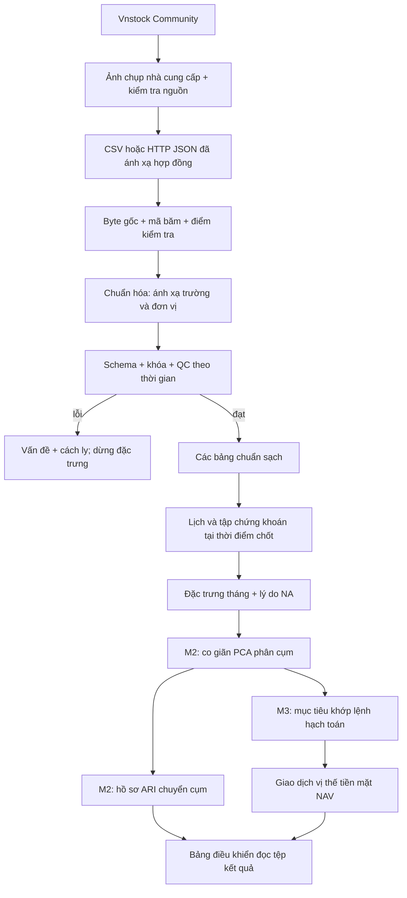

# Kiến trúc hiện hành v0.2

Nhà cung cấp → chuyển đổi có điều kiện bằng chứng (`ingestion/promotion.py`) → dữ liệu
chuẩn → `pipeline.process_raw` (dùng chung với CSV/HTTP) → đặc trưng →
`research.experiment`. KMeans/tiền xử lý, độ ổn định/căn chỉnh, danh mục, chương trình
không gian lợi suất và đánh giá hiệu quả được tách thành các mô-đun riêng. Các script
chỉ điều phối. JSONL/CSV/PNG và gói mô hình được quản lý phiên bản theo từng thí
nghiệm. Xem README, `methodology.md` và `backtest.md` cho phạm vi hiện tại. Chưa có
sổ cổ phiếu gốc/PCA/GMM/Ward/bảng điều khiển.

Các phần bên dưới là thiết kế nền **v0.1 lưu để đối chiếu lịch sử**; câu mô tả
M2/M3 là các giao diện và chưa có bước chuyển đổi đã được thay thế bằng phần triển khai v0.2.

# Kiến trúc nền v0.1

## Mục tiêu và lựa chọn

T1 nghiên cứu các nhóm cổ phiếu có động lượng/rủi ro tương tự trên HOSE/HNX. Đơn vị quan sát là `security_id × as_of_date`; đặc trưng lấy từ lịch sử đến ảnh chụp. Phiên bản đầu dùng Python 3.11+, xử lý lô cục bộ và tệp kết quả có phiên bản. Phần lõi chỉ dùng thư viện chuẩn để đồng đội chạy ngay; Vnstock là phần phụ thuộc tùy chọn, cô lập khỏi logic tính toán.

Không cần vi dịch vụ hay máy chủ cơ sở dữ liệu ở quy mô ban đầu. Mỗi giai đoạn có đầu vào/đầu ra rõ, nên về sau có thể đổi JSONL sang Parquet, thêm DuckDB hoặc bộ lập lịch mà không sửa công thức.

## Luồng tổng thể



Mũi tên nhà cung cấp → dữ liệu chuẩn cần bảng ánh xạ và kiểm tra; hiện không có mã nguồn tự phỏng đoán trường thiếu. Các bước đến đặc trưng đã triển khai. M2/M3 mới có giao diện, schema và kế hoạch.

## Cấu trúc thư mục

```text
SourceCode/
  README.md / CHANGELOG.md / DEVELOPMENT_RULES.md
  pyproject.toml / run.py
  configs/                       # cấu hình có phiên bản, không có bí mật
  docs/                          # rà soát, kiến trúc, hợp đồng, nguồn, kế hoạch
  examples/synthetic/            # CSV giả lập tái tạo được
  scripts/
    generate_demo.py              # tạo mẫu + cấu hình demo
    crawl_vnstock.py              # CLI tải mẫu nhà cung cấp
  src/delta_t1/
    cli.py                       # phân tích tham số, trạng thái thoát
    pipeline.py                  # điều phối + điều kiện công bố
    io.py                        # JSON/JSONL, ghi nguyên tử, SHA-256
    contracts.py                 # đọc và thực thi schema
    schemas/*.json               # hợp đồng bảng có phiên bản
    ingestion/
      providers.py               # CSV, HTTP JSON, phân trang, thử lại/giới hạn tốc độ
      crawler.py                 # công việc, dữ liệu gốc, manifest, tiếp tục
      vnstock.py                 # bộ chuyển đổi SDK qua tiến trình có giới hạn thời gian
      quality.py                 # chuẩn hóa, khóa ngoại thời gian, QC, độ phủ
    features/compute.py          # hàm thuần + ảnh chụp tháng
    clustering/interfaces.py     # hợp đồng mở rộng M2
    evaluation/interfaces.py     # hợp đồng độ ổn định M2
    backtest/interfaces.py       # hợp đồng tín hiệu/khớp lệnh M3
  app/                           # đặc tả bảng điều khiển, chưa có UI
  notebooks/                     # hướng dẫn EDA, chưa có kết luận nghiên cứu
  tests/                         # kiểm thử đơn vị + tích hợp, không cần internet
  data/runs/<run_id>/             # sinh khi chạy; không commit
  data/vendor/<vendor_run_id>/    # staging SDK; không commit
```

## Trách nhiệm và giao diện

| Phần | Đầu vào → đầu ra | Người phụ trách / người rà soát đề xuất |
|---|---|---|
| Trình thu thập | công việc/cấu hình → trang gốc, manifest, trạng thái tải | DE / QD |
| Chuẩn hóa/QC | dữ liệu gốc + ánh xạ trường → dữ liệu sạch, vấn đề, cách ly | DE / QC |
| Đặc trưng | dữ liệu sạch + lịch + chính sách rf → dòng theo tháng, điều kiện hợp lệ | DS / QC |
| Phân cụm | ảnh chụp đặc trưng đủ điều kiện → kết quả gán, hồ sơ, gói mô hình | DS / QD |
| Stability | hai snapshot → ARI, mapping, transitions, entered/exited | DS / QC |
| Tín hiệu | kết quả gán/hồ sơ tại thời điểm chốt → tỷ trọng + `decision_time` | DS/QD / QC |
| Khớp lệnh/hạch toán | mục tiêu + giá gốc + sự kiện + lịch → sổ giao dịch/NAV | QD / QC |
| Bảng điều khiển | các tệp kết quả cùng `run_id` → bảng/biểu đồ/bộ lọc | FE / DS/QD |

Người phụ trách là vai trò dự kiến, chưa phải phân công cá nhân. Giao diện M2/M3 dùng `Protocol`; không trả dữ liệu giả hoặc chỉ tiêu 0 để tạo cảm giác đã triển khai.

## Luồng dữ liệu chi tiết

1. `load_config` kiểm tra nhà cung cấp, ID công việc, bảng, ánh xạ, giả định đặc trưng và bí mật trong tham số.
2. `crawl` tạo lần chạy độc lập; lấy từng công việc/trang, lưu byte rồi ghi điểm kiểm tra ngay. Công việc lỗi được ghi riêng; công việc khác vẫn được tải. Có bất kỳ công việc lỗi thì không chuyển đổi dữ liệu sạch/đặc trưng.
3. `clean_tables` ép kiểu theo schema, đổi đơn vị theo cấu hình, giữ provenance và kiểm tra key/interval/OHLC/calendar. Mọi bản ghi trùng khóa bị cách ly để tránh tùy tiện chọn bản đầu/cuối.
4. `build_features` căn vào lịch của sàn có hiệu lực cho từng chứng khoán. Thiếu phiên để `None`; tính các cửa sổ rồi xuất phiên có cờ cuối tháng. Không khớp mô hình trong giai đoạn này.
5. `coverage` báo số mã/năm/sàn, first/last/observations theo mã, thiếu phiên và eligible theo snapshot. Gap chưa phân loại không tự gọi là ngày nghỉ/đình chỉ.
6. Manifest cuối lưu mã băm của dữ liệu sạch/QC/đặc trưng. `complete` chỉ cho biết pipeline không gặp lỗi nghiêm trọng; điều kiện hợp lệ và độ phủ vẫn phải được rà soát.

## Version và tái lập

- `data_version = run_id` cho mỗi snapshot nhập; data hash băm payload theo job/page có thứ tự.
- `schema_version` biểu diễn cấu trúc; `feature_version` biểu diễn công thức/policy.
- Config hash bao gồm config và hash CSV đầu vào. Code hash gồm `.py` và schema trong package; commit có thể là `unversioned` vì workspace ban đầu chưa có repo Git.
- `fetched_at`: lúc tải; `available_at`: lúc thông tin có thể được dùng; hai trường không thay thế nhau.
- Tạo lần chạy mới cho bản sửa đổi, cấu hình mới hoặc mã nguồn/schema mới. Tiếp tục lần chạy đòi mã băm khớp, kiểm tra dữ liệu gốc đã lưu đệm và chỉ tải trang còn thiếu.
- Ghi file qua file tạm rồi replace; chỉ chạy một writer trên một run. Chưa có distributed lock; hai người không cùng resume một run.
- CSV/HTTP giữ response nguyên bản. Vnstock giữ DataFrame do SDK trả, không tuyên bố lưu được HTTP response bên trong SDK.

## Các phần phát triển tiếp

M2: triển khai `fit_snapshot`, StandardScaler, PCA có/không, K-Means/Ward/GMM, chỉ tiêu trong không gian chung, hồ sơ trung vị/IQR, phiếu mô hình và manifest thí nghiệm có seed. Khớp riêng từng ảnh chụp; khóa lựa chọn trên tập phát triển.

Độ ổn định: ghép `security_id` trên tập chung, ARI độc lập nhãn, ánh xạ Hungarian để hiển thị, tách nhãn gốc/đã căn chỉnh; mã vào/ra không trộn vào mẫu số chuyển cụm.

M3: tách tín hiệu, khớp lệnh, danh mục, chi phí và báo cáo thành mô-đun con. Tín hiệu sau giờ đóng cửa t chỉ khớp phiên tiếp theo; chương trình phải kiểm tra giá gốc, quyền lợi, tiền mặt, lô, phí và lệnh từ chối. Các giả định chưa được quyết định nằm trong `DECISIONS.md`.

Dashboard đọc artifact qua cùng `run_id`; không tính lại clustering/Sharpe trên trình duyệt. Chưa cần API service; nếu sau này cần, service chỉ cung cấp artifact đã được kiểm chứng.

## Giới hạn v0.1.0

Phần lõi giữ bảng trong bộ nhớ, xử lý tuần tự. Chưa đo hiệu năng toàn bộ 300 mã/6 năm; chưa tối ưu cửa sổ trượt bằng véc-tơ hóa. JSONL dễ kiểm tra nhưng nặng hơn Parquet. Việc tiếp tục dựa trên trang/con trỏ cần nguồn có thứ tự và con trỏ ổn định; nguồn có bản sửa đổi nên tạo lần chạy mới. Chưa tự tạo danh sách 300 mã lịch sử, hợp nhất gia tăng, lịch nghỉ chính thức hoặc kiểm tra sự kiện doanh nghiệp. Đây là các hạng mục ưu tiên sau khi có mẫu thật.
