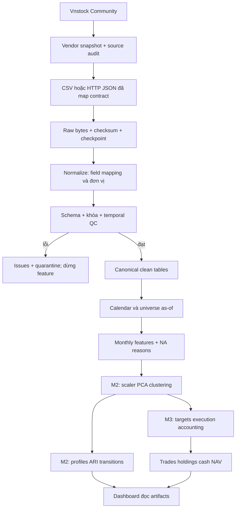

# Kiến trúc project và tổ chức code

## Mục tiêu và lựa chọn

T1 nghiên cứu các nhóm cổ phiếu có động lượng/rủi ro tương tự trên HOSE/HNX. Đơn vị quan sát là `security_id × as_of_date`; feature lấy từ lịch sử đến snapshot. Phiên bản đầu dùng Python 3.11+, batch local và artifact có phiên bản. Core chỉ dùng thư viện chuẩn để đồng đội chạy ngay; Vnstock là dependency tùy chọn, cô lập khỏi logic tính toán.

Không cần microservices/database server ở quy mô ban đầu. Mỗi stage có đầu vào/đầu ra rõ, nên về sau có thể đổi JSONL sang Parquet, thêm DuckDB hoặc scheduler mà không sửa công thức.

## Luồng tổng thể



Mũi tên vendor → canonical cần bảng mapping và audit; hiện không có code tự phỏng đoán trường thiếu. Các bước đến feature đã triển khai. M2/M3 mới có interfaces, schema và kế hoạch.

## Cấu trúc thư mục

```text
SourceCode/
  README.md / CHANGELOG.md / DEVELOPMENT_RULES.md
  pyproject.toml / run.py
  configs/                       # cấu hình versioned, không có secret
  docs/                          # review, architecture, contracts, source, plan
  examples/synthetic/            # CSV giả lập tái tạo được
  scripts/
    generate_demo.py              # tạo sample + demo config
    crawl_vnstock.py              # CLI tải vendor sample
  src/delta_t1/
    cli.py                       # parse args, exit status
    pipeline.py                  # orchestration + publish gate
    io.py                        # JSON/JSONL, atomic writes, SHA-256
    contracts.py                 # đọc và thực thi schema
    schemas/*.json               # table contract có version
    ingestion/
      providers.py               # CSV, HTTP JSON, pagination, retry/rate limit
      crawler.py                 # jobs, raw, manifest, resume
      vnstock.py                 # SDK adapter qua process có timeout
      quality.py                 # normalization, FK thời gian, QC, coverage
    features/compute.py          # hàm thuần + monthly snapshot
    clustering/interfaces.py     # contract mở rộng M2
    evaluation/interfaces.py     # contract stability M2
    backtest/interfaces.py       # contract signal/execution M3
  app/                           # đặc tả dashboard, chưa có UI
  notebooks/                     # hướng dẫn EDA, chưa có kết luận nghiên cứu
  tests/                         # unit + integration, không cần internet
  data/runs/<run_id>/             # sinh khi chạy; không commit
  data/vendor/<vendor_run_id>/    # staging SDK; không commit
```

## Trách nhiệm và giao diện

| Phần | Đầu vào → đầu ra | Owner / reviewer đề xuất |
|---|---|---|
| Crawler | jobs/config → raw pages, manifest, download status | DE / QD |
| Normalize/QC | raw + field mapping → clean, issues, quarantine | DE / QC |
| Features | clean + calendar + rf policy → monthly rows, eligibility | DS / QC |
| Clustering | eligible feature snapshot → assignments, profiles, model bundle | DS / QD |
| Stability | hai snapshot → ARI, mapping, transitions, entered/exited | DS / QC |
| Signal | assignments/profiles as-of → weights + decision_time | DS/QD / QC |
| Execution/accounting | targets + raw prices + actions + lịch → ledger/NAV | QD / QC |
| Dashboard | cùng run_id artifacts → bảng/biểu đồ/filter | FE / DS/QD |

Owner là vai trò dự kiến, chưa phải phân công cá nhân. Interface M2/M3 dùng `Protocol`; không trả dữ liệu giả hoặc metric 0 để làm như đã triển khai.

## Luồng dữ liệu chi tiết

1. `load_config` kiểm tra provider, job ID, table, mapping, giả định feature và secret trong params.
2. `crawl` tạo run độc lập; lấy từng job/page, lưu bytes rồi checkpoint ngay. Job lỗi được ghi riêng; job khác vẫn được tải. Có bất kỳ job lỗi thì không promote clean/feature.
3. `clean_tables` ép kiểu theo schema, đổi đơn vị theo cấu hình, giữ provenance và kiểm tra key/interval/OHLC/calendar. Mọi bản ghi trùng khóa bị cách ly để tránh tùy tiện chọn bản đầu/cuối.
4. `build_features` căn vào lịch của sàn có hiệu lực cho từng security. Thiếu phiên để `None`; tính các cửa sổ rồi xuất phiên có cờ cuối tháng. Không fit model trong stage này.
5. `coverage` báo số mã/năm/sàn, first/last/observations theo mã, thiếu phiên và eligible theo snapshot. Gap chưa phân loại không tự gọi là ngày nghỉ/đình chỉ.
6. Manifest cuối lưu checksum clean/QC/features. `complete` chỉ nói pipeline không gặp lỗi nghiêm trọng; eligibility và coverage vẫn phải review.

## Version và tái lập

- `data_version = run_id` cho mỗi snapshot nhập; data hash băm payload theo job/page có thứ tự.
- `schema_version` biểu diễn cấu trúc; `feature_version` biểu diễn công thức/policy.
- Config hash bao gồm config và hash CSV đầu vào. Code hash gồm `.py` và schema trong package; commit có thể là `unversioned` vì workspace ban đầu chưa có repo Git.
- `fetched_at`: lúc tải; `available_at`: lúc thông tin có thể được dùng; hai trường không thay thế nhau.
- Run mới cho revision, config mới hoặc code/schema mới. Resume đòi hash khớp, kiểm tra raw đã cache, chỉ tải trang còn thiếu.
- Ghi file qua file tạm rồi replace; chỉ chạy một writer trên một run. Chưa có distributed lock; hai người không cùng resume một run.
- CSV/HTTP giữ response nguyên bản. Vnstock giữ DataFrame do SDK trả, không tuyên bố lưu được HTTP response bên trong SDK.

## Các phần phát triển tiếp

M2: triển khai `fit_snapshot`, StandardScaler, PCA có/không, K-Means/Ward/GMM, metric trong không gian chung, profiles median/IQR, model card và experiment manifest có seed. Fit riêng từng snapshot; khóa lựa chọn trên development.

Stability: join security_id trên tập chung, ARI độc lập nhãn, Hungarian mapping cho hiển thị, raw/aligned labels riêng; entry/exit không trộn mẫu số transition.

M3: tách signal, execution, portfolio, costs và reporting thành module con. Tín hiệu sau close t chỉ khớp phiên tiếp theo; engine phải kiểm tra raw price, quyền lợi, cash, lô, phí và lệnh từ chối. Các giả định chưa được quyết định nằm trong `DECISIONS.md`.

Dashboard đọc artifact qua cùng `run_id`; không tính lại clustering/Sharpe trên trình duyệt. Chưa cần API service; nếu sau này cần, service chỉ cung cấp artifact đã được kiểm chứng.

## Giới hạn v0.1.0

Core giữ bảng trong bộ nhớ, xử lý tuần tự. Chưa benchmark toàn bộ 300 mã/6 năm; chưa tối ưu rolling bằng vectorization. JSONL dễ kiểm tra nhưng nặng hơn Parquet. Resume dựa trên page/cursor cần nguồn có thứ tự và cursor ổn định; nguồn revision nên tạo run mới. Chưa tự tạo danh sách 300 mã lịch sử, merge incremental, lịch nghỉ chính thức hoặc audit corporate action. Đây là các hạng mục ưu tiên sau khi có sample thật.
