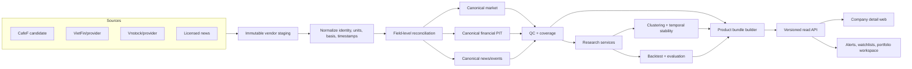

# Product-first architecture 2.0

## Architectural decision

Delta Intelligence là nền tảng company/ticker intelligence. Research là upstream producer của insight có phiên bản; product chỉ đọc. Clustering là một capability bên cạnh market data, fundamentals, news/sentiment và data quality.

## Bounded contexts

| Context | Owns | Does not own |
|---|---|---|
| Source acquisition | requests, raw response, provider/version/rights metadata | canonical meaning |
| Canonical data | historical identity, market, financial PIT, news/event references | model selection |
| Research | feature registry, preprocessing, models, cluster quality/stability, backtest | UI state/live requests |
| Product projection | stable company-detail JSON from immutable runs | model recomputation |
| API edge | routing, validation, caching/auth later | business calculations |
| Web | interaction, charts, missing-state UX | raw source access/formulas |

## Implemented vertical slice

`src/delta_t1/product/builder.py` combines a complete canonical run, feature run and experiment into an immutable bundle. A company payload contains identity, quote/history with price basis, public market analytics, aligned cluster/profile/peers/history, explicit unavailable states, warnings and run provenance.

`src/delta_t1/product/server.py` exposes API v1 and serves `web/`. It currently uses only the Python standard library. A production edge can later move to FastAPI/PostgreSQL/Redis without changing the payload contract.

## Non-negotiable boundaries

1. Browser code never reads `data/` or recalculates research outputs.
2. Product export requires `experiment.status=complete`.
3. Missing stays missing; zero is never a placeholder.
4. Every insight carries its as-of date and source run IDs.
5. Pilot limitations survive projection into the product.
6. Fundamentals use publication/availability time; restatements create new vintages.
7. News requires a rights decision before text is stored or redistributed.

## Scale and migration

The target can exceed 1,200 securities and 15 years (~4.5 million daily rows). JSONL remains suitable for reproducible pilots. Accepted scale design uses Parquet/DuckDB for analytics and PostgreSQL/object storage for serving; data is partitioned and crawled incrementally with checkpoints.

Existing IO, contracts, ingestion, QC, clustering stability and backtest utilities remain. They move only when an interface requires it; folder motion alone is not architecture. KBS pilot orchestration is reproducibility material, no longer the product entry point. Superseded smoke documents/configs with no live dependency are deleted.
