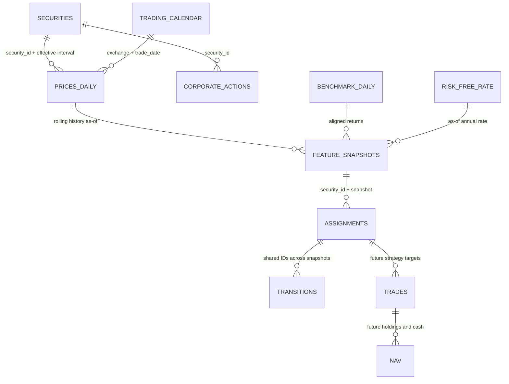

# Data contract, schema và quan hệ

## Nguồn chuẩn của schema

Các file `src/delta_t1/schemas/*.json` là **định dạng table contract của project**, không giả làm JSON Schema Draft 2020-12. `contracts.py` trực tiếp đọc các file này để normalize/validate khi chạy. Mỗi file có `contract_format`, `schema_version`, `table`, `primary_key`, `fields`, `relations`.

`fields` khai báo `type`, `nullable`, `enum`, `min` hoặc `exclusive_min`. Hỗ trợ string, number, integer, boolean, date, datetime, object, array. Number phải hữu hạn; date ISO `YYYY-MM-DD`; datetime bắt buộc offset. Chưa validate đệ quy nội dung object/array. Thay schema phải cập nhật tests và version, không có generator ngầm chạy ở production.

Mapping cấu hình là `canonical_field -> vendor_field`; multiplier áp dụng **sau ép kiểu**, theo từng field. Cột thừa ở provider chỉ lưu trong raw. Output canonical phải đúng tập cột schema. Khi nullable bị thiếu thì xuất `null`, không xuất NaN hoặc `""`.

## Các bảng input

| Schema | Khóa trong một data_version | Trường quan trọng / nơi sử dụng |
|---|---|---|
| `securities.json` | security_id, valid_from | ticker, exchange, company_name, listing/delisting, valid_to, available_at, sector/industry, currency/price_unit, identity_status; universe và temporal join |
| `prices_daily.json` | security_id, trade_date | raw OHLC nullable, adj_close > 0, adjustment_basis, volume, traded_value nullable, trading_status, available_at; feature, sau này execution |
| `benchmark_daily.json` | index_id, trade_date | close, total_return_level nullable, available_at; beta và so VNINDEX |
| `trading_calendar.json` | exchange, trade_date | is_open, is_month_end, close_at, decision_at; rolling và ngày snapshot/khớp |
| `corporate_actions.json` | event_id | security_id, event_type, announcement/ex/record/effective dates, available_at, factor/amount/ratio; audit adjustment và engine M3 |
| `risk_free_rate.json` | date, tenor, available_at | annual_rate dạng thập phân; Sharpe theo tenor đã cấu hình |

Input có `source`, `fetched_at`, `data_version`. Pipeline gán provenance của lần tải, không tin version cũ trong CSV. Mọi bảng clean cùng run có cùng data_version. Khi hợp nhất nhiều version vào database sau này, phải đưa data_version vào khóa lưu trữ.

## Quan hệ

Đây là sơ đồ lineage; không phải mọi cạnh đều là SQL foreign key một cột. Giá → feature là tập nhiều phiên; trades → NAV qua kế toán vị thế và tiền. `relations` trong JSON là mô tả; kiểm tra thực thi hiện có ở `quality.py` gồm identity theo thời gian, ticker/sàn, listing lifetime, calendar và action.security_id. Contract M2/M3 chưa có validator quan hệ xuyên artifact vì chưa có engine.

## Định danh có thời gian

`security_id` phải ổn định qua đổi ticker/chuyển sàn. Không dùng ticker làm ID lịch sử chính thức. `valid_from` bao gồm ngày bắt đầu, `valid_to` loại trừ ngày kết thúc; null là chưa biết ngày kết thúc. Với delisting, v0.1 quy ước ngày đó không còn được giao dịch; cần map theo ý nghĩa ngày mà nguồn công bố.

Ví dụ một security đổi mã: metadata cũ hiệu lực `[2024-01-01,2025-01-01)`, metadata mới từ `2025-01-01`; dòng giá 2024 phải mang ticker cũ. Hai interval của cùng security hoặc cùng ticker/sàn không được giao nhau. `available_at` không được suy từ ngày tải rồi lùi ngược tùy ý.

`identity_status=provisional` dùng cho mapping chưa xác minh và không đủ điều kiện đưa vào clustering; `synthetic` chỉ dành demo. Một danh sách niêm yết hôm nay không chứng minh universe năm 2020.

## Đơn vị và giá

- Canonical equity price là **VND/cổ phiếu**, volume là số cổ phiếu, traded_value là VND; index close là điểm chỉ số, không nhân 1.000 theo quy tắc giá cổ phiếu.
- Ví dụ nguồn thực sự tính nghìn VND: cấu hình multiplier 1.000 riêng cho các field giá đã xác minh. Không tự nhân theo độ lớn giá.
- `raw_close` được phép null để phản ánh nguồn thiếu; `adj_close` không được tạo bằng copy raw nếu chưa xác minh adjustment. Engine giao dịch sau này bắt buộc đủ giá gốc tương ứng.
- `adjustment_basis`: split_adjusted / total_return / unknown / synthetic. Feature chỉ dùng các basis được config chấp nhận; unknown không được accept.
- V0.1 chỉ tính liquidity từ traded_value thật. Không dùng adjusted close × volume làm giá trị giao dịch. Nếu bổ sung proxy, thêm trường loại proxy và version schema trước.
- Giữ `cash_amount`, `ratio`, `adjustment_factor` riêng: ratio dùng nghĩa số cổ phiếu mới trên một cổ phiếu cũ; factor dùng nghĩa cụ thể phải xác nhận với nguồn. Chưa có engine tự áp quyền.

## Schema output

`vendor_snapshot.json` mô tả envelope staging SDK: job, fetched_at, version, source_routing, sdk_metadata, columns và records. Worker validate envelope trước ghi; records vẫn là columns của provider, chưa validate theo prices_daily. Worker chạy trong staging/work để các file onboarding do SDK tự sinh không nằm ở code root.

| File | Khóa | Trạng thái |
|---|---|---|
| `feature_snapshots.json` | security_id, as_of_date | Được normalize/validate thực tế trước xuất |
| `assignments.json` | run_id, snapshot_date, security_id | Contract dự kiến M2: raw/aligned label, PCA x/y, data_version |
| `transitions.json` | run_id, from_date, to_date, from_cluster, to_cluster | Contract dự kiến M2: count, denominator trên tập chung, rate |
| `trades.json` | run_id, trade_id | Contract dự kiến M3: signal/execution time, side, qty, raw price, fees, rejection |
| `nav.json` | run_id, strategy_id, date | Contract dự kiến M3: cash, holdings, gross/net, benchmark, drawdown |

`feature_snapshots.na_reason` là map field → lý do. `eligibility` yêu cầu đủ toàn bộ required_features, mã giao dịch normal, metadata đã biết và identity không provisional. Các metric thiếu không tự chuyển thành 0.

Issues/quarantine/coverage và manifest là báo cáo JSON theo code hiện tại, chưa có table contract riêng. Chưa xem các báo cáo đó là public API ổn định. Khi FE bắt đầu tích hợp, bổ sung schema report/profile/model manifest trong cùng PR contract.

## Xử lý lỗi

Lỗi kiểu/giá/khóa/OHLC/metadata/calendar được cách ly, có rule_id và row để đối chiếu. Bất kỳ lỗi nghiêm trọng nào đều chặn feature của run, mặc dù clean tạm vẫn được ghi để debug. Không silently drop duplicate. Sửa dữ liệu đầu vào/map rồi tạo run mới, giữ run lỗi để audit.

Coverage liệt kê gap chưa phân loại. Không có dòng giá không tự đồng nghĩa thị trường nghỉ; có thể là đình chỉ hoặc lỗi tải. `is_month_end` phải lấy từ lịch đủ tháng đã xác minh, không từ ngày cuối response API.
