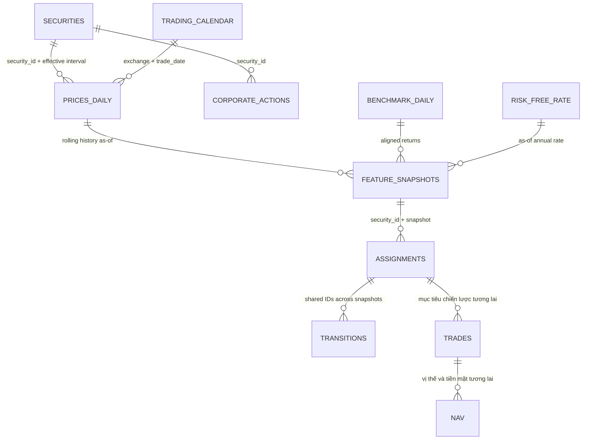

# Hợp đồng dữ liệu 1.1 và chuyển phiên bản

Nguồn thực thi vẫn là `schemas/*.json`. Từ điển đầy đủ: `data_dictionary.md`.
Phiên bản 1.1 hỗ trợ UPCOM; `adj_close`/`volume` cho phép `null`; bổ sung
`unadjusted`; lịch có `open_at` và `available_at`; chỉ số tham chiếu có `exchange` và
`index_basis`; sự kiện có `reverse_split`/`bonus_share`, `payment_date`/`currency`;
lãi suất có `day_count_basis`. Đặc trưng 1.1 bổ sung `downside_vol_63`, `ram_63`,
`lookback_observations`, `missing_count`, `listing_age_days` và `adjustment_basis`.
Tuổi niêm yết không biết thì để `null`, không suy từ `valid_from`.

Giữ khoảng `[valid_from,valid_to)` để tương thích. CSV giả lập cũ thiếu trường cho
phép `null` vẫn đọc được; đầu ra phải đúng tập trường 1.1. Không viết lại lần chạy cũ:
chạy lại đầu vào đã đóng băng thành lần chạy mới. Pipeline dữ liệu thật chặn khi thiếu
thời điểm khả dụng của lịch hoặc cơ sở chỉ số; bảng lãi suất thật cần quy đổi theo quy
ước rõ ràng. `assignments`/`transitions` được kiểm tra; `trades`/`nav` vẫn là hợp đồng
dành cho chương trình dùng dữ liệu gốc trong tương lai. Báo cáo trong không gian lợi
suất không giả làm giao dịch/số lượng theo schema đó.

Nội dung dưới đây là contract **v0.1 lịch sử**; thay đổi 1.1 ở trên có hiệu lực.

# Hợp đồng dữ liệu v0.1

## Nguồn chuẩn của schema

Các file `src/delta_t1/schemas/*.json` là **định dạng hợp đồng bảng của dự án**, không giả làm JSON Schema Draft 2020-12. `contracts.py` trực tiếp đọc các file này để chuẩn hóa/kiểm tra khi chạy. Mỗi file có `contract_format`, `schema_version`, `table`, `primary_key`, `fields`, `relations`.

`fields` khai báo `type`, `nullable`, `enum`, `min` hoặc `exclusive_min`. Hỗ trợ các kiểu chuỗi, số, số nguyên, luận lý, ngày, thời gian, đối tượng và mảng tương ứng với giá trị schema. Số phải hữu hạn; ngày theo ISO `YYYY-MM-DD`; thời gian bắt buộc có độ lệch múi giờ. Chưa kiểm tra đệ quy nội dung đối tượng/mảng. Thay schema phải cập nhật kiểm thử và phiên bản; không có trình sinh ngầm chạy trong môi trường vận hành.

Ánh xạ cấu hình là `canonical_field -> vendor_field`; hệ số nhân áp dụng **sau ép kiểu**, theo từng trường. Cột thừa từ nhà cung cấp chỉ lưu trong dữ liệu gốc. Đầu ra chuẩn phải đúng tập cột schema. Khi trường cho phép `null` bị thiếu thì xuất `null`, không xuất NaN hoặc `""`.

## Các bảng đầu vào

| Schema | Khóa trong một data_version | Trường quan trọng / nơi sử dụng |
|---|---|---|
| `securities.json` | security_id, valid_from | ticker, exchange, company_name, listing/delisting, valid_to, available_at, sector/industry, currency/price_unit, identity_status; universe và temporal join |
| `prices_daily.json` | security_id, trade_date | raw OHLC nullable, adj_close > 0, adjustment_basis, volume, traded_value nullable, trading_status, available_at; feature, sau này execution |
| `benchmark_daily.json` | index_id, trade_date | close, total_return_level nullable, available_at; beta và so VNINDEX |
| `trading_calendar.json` | exchange, trade_date | is_open, is_month_end, close_at, decision_at; rolling và ngày snapshot/khớp |
| `corporate_actions.json` | event_id | security_id, event_type, announcement/ex/record/effective dates, available_at, factor/amount/ratio; audit adjustment và engine M3 |
| `risk_free_rate.json` | date, tenor, available_at | annual_rate dạng thập phân; Sharpe theo tenor đã cấu hình |

Đầu vào có `source`, `fetched_at`, `data_version`. Pipeline gán thông tin truy vết của lần tải, không tin phiên bản cũ trong CSV. Mọi bảng sạch trong cùng lần chạy có chung `data_version`. Khi hợp nhất nhiều phiên bản vào cơ sở dữ liệu sau này, phải đưa `data_version` vào khóa lưu trữ.

## Quan hệ

Đây là sơ đồ truy vết; không phải mọi cạnh đều là khóa ngoại SQL một cột. Giá → đặc trưng là tập nhiều phiên; giao dịch → NAV qua hạch toán vị thế và tiền. `relations` trong JSON là mô tả; kiểm tra thực thi hiện có ở `quality.py` gồm định danh theo thời gian, ticker/sàn, vòng đời niêm yết, lịch và `action.security_id`. Hợp đồng M2/M3 chưa có bộ kiểm tra quan hệ xuyên tệp kết quả vì chưa có chương trình đầy đủ.

## Định danh có thời gian

`security_id` phải ổn định qua đổi ticker/chuyển sàn. Không dùng ticker làm ID lịch sử chính thức. `valid_from` bao gồm ngày bắt đầu, `valid_to` loại trừ ngày kết thúc; null là chưa biết ngày kết thúc. Với delisting, v0.1 quy ước ngày đó không còn được giao dịch; cần map theo ý nghĩa ngày mà nguồn công bố.

Ví dụ một security đổi mã: metadata cũ hiệu lực `[2024-01-01,2025-01-01)`, metadata mới từ `2025-01-01`; dòng giá 2024 phải mang ticker cũ. Hai interval của cùng security hoặc cùng ticker/sàn không được giao nhau. `available_at` không được suy từ ngày tải rồi lùi ngược tùy ý.

`identity_status=provisional` dùng cho mapping chưa xác minh và không đủ điều kiện đưa vào clustering; `synthetic` chỉ dành demo. Một danh sách niêm yết hôm nay không chứng minh universe năm 2020.

## Đơn vị và giá

- Canonical equity price là **VND/cổ phiếu**, volume là số cổ phiếu, traded_value là VND; index close là điểm chỉ số, không nhân 1.000 theo quy tắc giá cổ phiếu.
- Ví dụ nguồn thực sự tính nghìn VND: cấu hình hệ số 1.000 riêng cho các trường giá đã xác minh. Không tự nhân theo độ lớn giá.
- `raw_close` được phép `null` để phản ánh nguồn thiếu; không được tạo `adj_close` bằng cách sao chép giá gốc nếu chưa xác minh cơ sở điều chỉnh. Chương trình giao dịch sau này bắt buộc đủ giá gốc tương ứng.
- `adjustment_basis`: split_adjusted / total_return / unknown / synthetic. Feature chỉ dùng các basis được config chấp nhận; unknown không được accept.
- V0.1 chỉ tính thanh khoản từ `traded_value` thật. Không dùng giá đóng cửa điều chỉnh × khối lượng làm giá trị giao dịch. Nếu bổ sung đại diện, phải thêm trường loại đại diện và tăng phiên bản schema trước.
- Giữ `cash_amount`, `ratio`, `adjustment_factor` riêng: ratio dùng nghĩa số cổ phiếu mới trên một cổ phiếu cũ; factor dùng nghĩa cụ thể phải xác nhận với nguồn. Chưa có engine tự áp quyền.

## Schema đầu ra

`vendor_snapshot.json` mô tả envelope staging SDK: job, fetched_at, version, source_routing, sdk_metadata, columns và records. Worker validate envelope trước ghi; records vẫn là columns của provider, chưa validate theo prices_daily. Worker chạy trong staging/work để các file onboarding do SDK tự sinh không nằm ở code root.

| File | Khóa | Trạng thái |
|---|---|---|
| `feature_snapshots.json` | security_id, as_of_date | Được normalize/validate thực tế trước xuất |
| `assignments.json` | run_id, snapshot_date, security_id | Contract dự kiến M2: raw/aligned label, PCA x/y, data_version |
| `transitions.json` | run_id, from_date, to_date, from_cluster, to_cluster | Contract dự kiến M2: count, denominator trên tập chung, rate |
| `trades.json` | run_id, trade_id | Hợp đồng dự kiến M3: thời điểm tín hiệu/khớp lệnh, chiều giao dịch, số lượng, giá gốc, phí, lý do từ chối |
| `nav.json` | run_id, strategy_id, date | Contract dự kiến M3: cash, holdings, gross/net, benchmark, drawdown |

`feature_snapshots.na_reason` ánh xạ trường → lý do. `eligibility` yêu cầu đủ toàn bộ `required_features`, mã có trạng thái giao dịch `normal`, metadata đã biết và định danh không phải `provisional`. Các chỉ tiêu thiếu không tự chuyển thành 0.

Issues/quarantine/coverage và manifest là báo cáo JSON theo code hiện tại, chưa có table contract riêng. Chưa xem các báo cáo đó là public API ổn định. Khi FE bắt đầu tích hợp, bổ sung schema report/profile/model manifest trong cùng PR contract.

## Xử lý lỗi

Lỗi kiểu/giá/khóa/OHLC/metadata/lịch được cách ly, có `rule_id` và dòng để đối chiếu. Bất kỳ lỗi nghiêm trọng nào đều chặn đặc trưng của lần chạy, mặc dù dữ liệu sạch tạm vẫn được ghi để gỡ lỗi. Không âm thầm bỏ bản ghi trùng. Sửa dữ liệu đầu vào/ánh xạ rồi tạo lần chạy mới, giữ lần chạy lỗi để kiểm tra.

Coverage liệt kê gap chưa phân loại. Không có dòng giá không tự đồng nghĩa thị trường nghỉ; có thể là đình chỉ hoặc lỗi tải. `is_month_end` phải lấy từ lịch đủ tháng đã xác minh, không từ ngày cuối response API.
